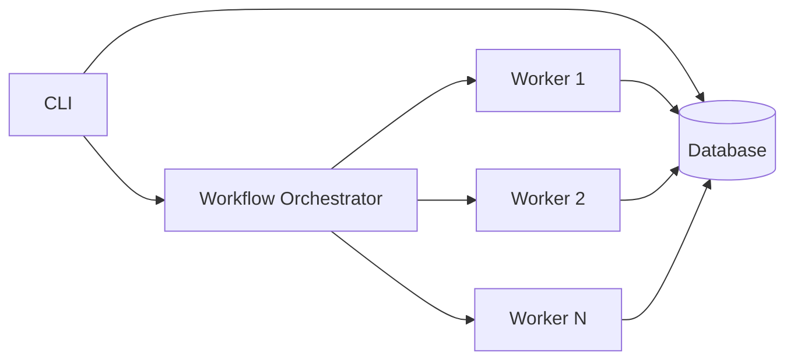
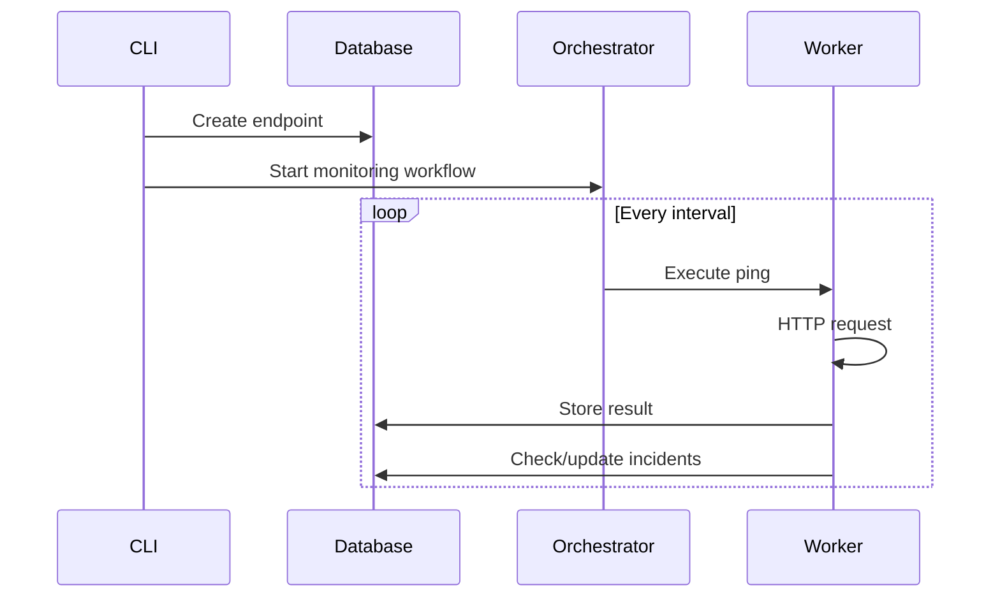
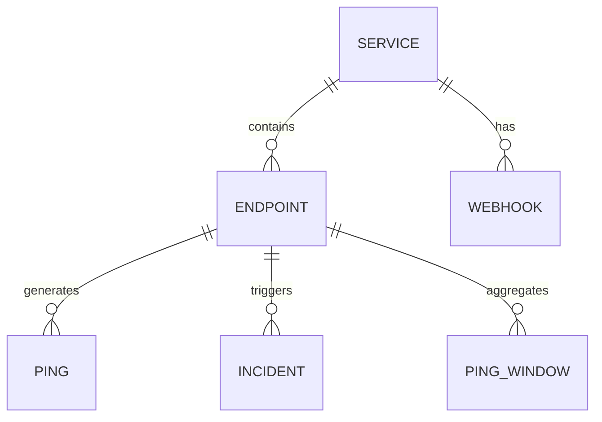

# Beacon

A distributed API monitoring system built for infinite scale through server/client architecture and durable workflow orchestration.

## Key Differentiators

- **Infinite horizontal scaling** - Stateless workers can be added without limit
- **Headless by design** - CLI-only interface, no UI bottlenecks
- **Distributed architecture** - Complete separation of monitoring execution from control plane
- **Workflow-powered** - Durable execution with exactly-once semantics and automatic retries

## Architecture



The system separates concerns into three layers:

1. **Control Plane** - CLI for all operations (CRUD, monitoring control)
2. **Orchestration** - Distributed workflow execution and task scheduling
3. **Workers** - Stateless executors that perform monitoring tasks

This architecture enables linear scaling: each worker handles `n` endpoints independently. Add workers to increase capacity.

## How It Works

### Monitoring Flow



### Core Workflows

**MonitorEndpoint** - Continuous monitoring loop for each endpoint
```
for {
    result = PingEndpoint(endpointID)
    CheckIncidentStatus(endpointID, result.Success)
    Sleep(interval)
}
```

**AggregateMetrics** - 5-minute sliding window aggregation
```
for {
    endpoints = GetEnabledEndpoints()
    for each endpoint {
        AggregateMetrics(endpoint, windowStart, windowEnd)
    }
    Sleep(5 minutes)
}
```

## Quick Start

```bash
# Start infrastructure (database + orchestrator)
make up

# Initialize database schema
make migrate

# Build CLI
make build

# Create a service
./bin/beacon services create --name "Production API" --description "Main API endpoints"

# Add an endpoint to monitor
./bin/beacon endpoints create \
  --service-id <uuid> \
  --name "Health Check" \
  --url "https://api.example.com/health" \
  --interval 60

# Start worker (runs monitoring)
make run-worker
```

## CLI Reference

### Services
```bash
beacon services create --name <name> --description <desc>
beacon services list
beacon services get <id>
beacon services update <id> --name <name>
beacon services delete <id>
```

### Endpoints
```bash
beacon endpoints create --service-id <id> --url <url> --interval <sec>
beacon endpoints list [--service-id <id>]
beacon endpoints get <id>
beacon endpoints update <id> [--enabled=false]
beacon endpoints delete <id>
```

### Monitoring
```bash
beacon pings list --endpoint-id <id> [--limit 100]
beacon incidents list [--status open]
beacon incidents resolve <id>
```

### Webhooks
```bash
beacon webhooks create --service-id <id> --url <url> --events incident_start,incident_resolved
beacon webhooks list
beacon webhooks delete <id>
```

## Scaling

The system scales linearly with worker count:

| Workers | Capacity (1-min checks) | Resource Usage |
|---------|-------------------------|----------------|
| 1 | ~100 endpoints | 100MB RAM |
| 10 | ~1,000 endpoints | 1GB RAM |
| 100 | ~10,000 endpoints | 10GB RAM |
| 1000 | ~100,000 endpoints | 100GB RAM |

Workers are stateless and can be deployed anywhere with network access to the database and orchestrator.

## Data Model



- **Services** - Logical grouping of related endpoints
- **Endpoints** - URLs to monitor with configuration
- **Pings** - Individual monitoring results
- **Incidents** - Detected outages and resolutions
- **PingWindows** - 5-minute aggregated metrics
- **Webhooks** - Notifications for incident events

## Deployment

### Docker Compose (included)
```bash
make up  # Starts database, orchestrator, and worker
```

### Kubernetes
```yaml
apiVersion: apps/v1
kind: Deployment
metadata:
  name: beacon-worker
spec:
  replicas: 10  # Scale horizontally
  template:
    spec:
      containers:
      - name: worker
        image: beacon-worker:latest
        env:
        - name: DATABASE_URL
          value: <connection-string>
        - name: TEMPORAL_HOST
          value: orchestrator:7233
```

### Environment Variables

| Variable | Description | Default |
|----------|-------------|---------|
| `DATABASE_URL` | Database connection string | - |
| `TEMPORAL_HOST` | Workflow orchestrator address | localhost:7233 |
| `WORKER_CONCURRENCY` | Parallel activities per worker | 10 |

## Why Beacon?

### vs Traditional Monitoring

Traditional monitoring systems couple the UI, monitoring logic, and data storage. This creates bottlenecks and limits scale. Beacon separates these concerns completely:

- **No UI server** - CLI directly interacts with database
- **No central scheduler** - Work is distributed automatically by the orchestrator
- **No worker state** - Workers can fail/restart without data loss

### vs SaaS Solutions

- **Self-hosted** - Complete control over your monitoring data
- **Cost-effective** - Scales with cheap compute, not API pricing
- **Customizable** - Modify workflows, add custom checks
- **No vendor lock-in** - Built on open standards

## System Requirements

- **Runtime** - Go 1.21+ or compatible container runtime
- **Database** - SQL database with JSON support
- **Orchestrator** - Workflow engine with durable execution
- **Container Platform** - Docker or Kubernetes for deployment

## Contributing

Beacon is designed for extensibility. Key extension points:

- Add new activity types in `internal/temporal/activities.go`
- Create custom workflows in `internal/temporal/workflows.go`
- Extend CLI commands in `internal/cli/`

## License

MIT